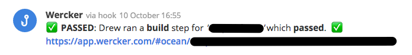

# fleep-webhook-notify

Send a message to a Fleep conversation by sending an HTTP request to a specified Fleep generic webhook.

## Fleep setup

Set up a generic webhook for your conversation using the instructions at https://fleep.io/blog/integrations/webhooks/

## Options
### required

 * `$FLEEP_WEBHOOK_URL` - Your Fleep generic webhook URL (I set up a new one for my conversation, and called it "Hook"), set as a Wercker environment variable (instructions at http://devcenter.wercker.com/docs/environment-variables/creating-env-vars.html)

## Parameters pulled from the Wercker pipeline:

 * `result` - result of step: `passed`✅ or `failed` ❌ .
 * `type` - type of step: `build` or `deploy`.
 * `application_name` - the Wercker application (system) name.
 * `build_url` - URL of the build output on Wercker.
 * `started_by` - the name of the Wercker user who started the build.

From these parameters a Fleep message is built which is formatted like so:

> **Wercker**

> `result`: `started_by` ran a `type` step for `application_name` which `result`.

> `build_url` 

In Fleep, that looks a little bit like this:

## Example

Add `FLEEP_WEBHOOK_URL` as deploy target or application environment variable.

    build:
       after-steps:
          - ocean/fleep-webhook-notify:
              url: $FLEEP_WEBHOOK_URL

## Credits

Thanks to [mzp](https://github.com/mzp) whose [`http-notify` step](https://github.com/mzp/wercker-step-http-notify) I forked. 👍

**Drew Robinson, [@ocean][1]** :ocean:.

[][1]

[1]: https://twitter.com/ocean